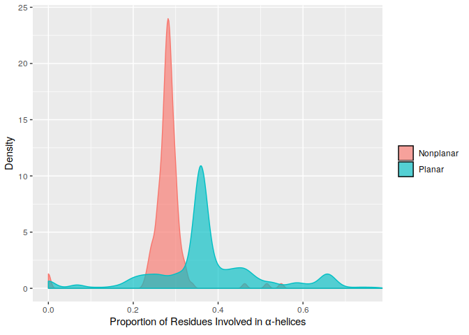

planar\_eda
================

``` r
data <- read.csv("helix_residue_prop_data.csv")
t.test(data$planars, data$nonplanars)
```

    ## 
    ##  Welch Two Sample t-test
    ## 
    ## data:  data$planars and data$nonplanars
    ## t = 15.381, df = 735.88, p-value < 2.2e-16
    ## alternative hypothesis: true difference in means is not equal to 0
    ## 95 percent confidence interval:
    ##  0.08381534 0.10834238
    ## sample estimates:
    ## mean of x mean of y 
    ## 0.3756308 0.2795520

``` r
columns <- c(1,2)
data <- data %>% gather(key="planarity", value="helices", columns, na.rm=TRUE)
```

    ## Note: Using an external vector in selections is ambiguous.
    ## ℹ Use `all_of(columns)` instead of `columns` to silence this message.
    ## ℹ See <https://tidyselect.r-lib.org/reference/faq-external-vector.html>.
    ## This message is displayed once per session.

``` r
p <- ggplot(data, aes(helices, color=factor(planarity), fill=factor(planarity))) + geom_density(alpha=.65)
p <- p + labs(x=expression("Proportion of Residues Involved in "*alpha*"-helices"), y="Density")
p <- p + coord_cartesian(xlim=c(0, 0.75))
p + scale_fill_discrete(name="", breaks=c("nonplanars", "planars"), labels=c("Nonplanar","Planar")) + guides(color=FALSE)
```

<!-- -->

``` r
data <- read.csv("strand_residue_prop_data.csv")
wilcox.test(data$planars, data$nonplanars)
```

    ## 
    ##  Wilcoxon rank sum test with continuity correction
    ## 
    ## data:  data$planars and data$nonplanars
    ## W = 86148, p-value = 5.522e-09
    ## alternative hypothesis: true location shift is not equal to 0

``` r
columns <- c(1,2)
data <- data %>% gather(key="planarity", value="strands", columns, na.rm=TRUE)
```

``` r
p <- ggplot(data, aes(strands, color=factor(planarity), fill=factor(planarity))) + geom_density(alpha=.65)
p <- p + labs(x=expression("Proportion of Residues Involved in "*beta*"-strands"), y="Density")
p + scale_fill_discrete(name="", breaks=c("nonplanars", "planars"), labels=c("Nonplanar","Planar")) + guides(color=FALSE)
```

<!-- -->

``` r
data <- read.csv("num_repeats_by_planarity.csv")
wilcox.test(data$planars, data$nonplanars)
```

    ## 
    ##  Wilcoxon rank sum test with continuity correction
    ## 
    ## data:  data$planars and data$nonplanars
    ## W = 105984, p-value < 2.2e-16
    ## alternative hypothesis: true location shift is not equal to 0

``` r
columns <- c(1,2)
data <- data %>% gather(key="planarity", value="repeats", columns, na.rm=TRUE)
```

``` r
p <- ggplot(data, aes(repeats, color=factor(planarity), fill=factor(planarity))) + geom_density(alpha=.65)
p <- p + labs(x="Counts of Repeated Polypeptides", y="Density")
p + scale_fill_discrete(name="", breaks=c("nonplanars", "planars"), labels=c("Nonplanar","Planar")) + guides(color=FALSE)
```

<!-- -->

``` r
data <- read.csv("prop_repeats_by_planarity.csv")
wilcox.test(data$planars, data$nonplanars)
```

    ## 
    ##  Wilcoxon rank sum test with continuity correction
    ## 
    ## data:  data$planars and data$nonplanars
    ## W = 107508, p-value < 2.2e-16
    ## alternative hypothesis: true location shift is not equal to 0

``` r
columns <- c(1,2)
data <- data %>% gather(key="planarity", value="prop_repeats", columns, na.rm=TRUE)
```

``` r
p <-ggplot(data, aes(prop_repeats, color=factor(planarity), fill=factor(planarity))) + geom_density(alpha=.65)
p <- p + labs(x="Proportions of Repeated Polypeptides", y="Density")
p + scale_fill_discrete(name="", breaks=c("nonplanars", "planars"), labels=c("Nonplanar","Planar")) + guides(color=FALSE)
```

<!-- -->

``` r
data <- read.csv("pct_essentiality_by_planarity.csv")
wilcox.test(data$planars, data$nonplanars)
```

    ## 
    ##  Wilcoxon rank sum test with continuity correction
    ## 
    ## data:  data$planars and data$nonplanars
    ## W = 75497, p-value = 0.002937
    ## alternative hypothesis: true location shift is not equal to 0

``` r
columns <- c(1,2)
data <- data %>% gather(key="planarity", value="pct_essentiality", columns, na.rm=TRUE)
```

``` r
ggplot(data, aes(pct_essentiality, color=factor(planarity), fill=factor(planarity))) + geom_density(alpha=.65)
```

<!-- -->

``` r
p <- p + labs(x="", y="Density")
p + scale_fill_discrete(name="Group", breaks=c("nonplanars", "planars"), labels=c("Nonplanar","Planar")) + guides(color=FALSE)
```

<!-- -->

``` r
data <- read.csv("hydrophobicity_by_planarity.csv")
t.test(data$planars, data$nonplanars)
```

    ## 
    ##  Welch Two Sample t-test
    ## 
    ## data:  data$planars and data$nonplanars
    ## t = 3.9084, df = 928.91, p-value = 9.964e-05
    ## alternative hypothesis: true difference in means is not equal to 0
    ## 95 percent confidence interval:
    ##  0.00591475 0.01784520
    ## sample estimates:
    ## mean of x mean of y 
    ## 0.2327139 0.2208339

``` r
var.test(data$planars, data$nonplanars, alternative="two.sided")
```

    ## 
    ##  F test to compare two variances
    ## 
    ## data:  data$planars and data$nonplanars
    ## F = 14.641, num df = 771, denom df = 173, p-value < 2.2e-16
    ## alternative hypothesis: true ratio of variances is not equal to 1
    ## 95 percent confidence interval:
    ##  11.48745 18.33550
    ## sample estimates:
    ## ratio of variances 
    ##           14.64072

``` r
#s1 <- var(data$planars)
#s2 <- var(data$nonplanars, na.rm=TRUE)
#alpha = 0.05

#qf(1 - (alpha / 2), df1=(n2-1), df2=(n1-1))
columns <- c(1,2)
data <- data %>% gather(key="planarity", value="hydrophobicity", columns, na.rm=TRUE)
```

``` r
p <- ggplot(data, aes(hydrophobicity, color=factor(planarity), fill=factor(planarity))) + geom_density(alpha=.65)
p <- p + labs(x="Mean Hydrophobicity (relative to glycine)", y="Density")
p <- p + coord_cartesian(xlim=c(0, 0.4))
p + scale_fill_discrete(name="", breaks=c("nonplanars", "planars"), labels=c("Nonplanar","Planar")) + guides(color=FALSE)
```

<!-- -->

``` r
data <- read.csv("binding_affinity/binding_aff_by_planarity.csv")
wilcox.test(data$planars, data$nonplanars)
```

    ## 
    ##  Wilcoxon rank sum test with continuity correction
    ## 
    ## data:  data$planars and data$nonplanars
    ## W = 61198, p-value = 0.0121
    ## alternative hypothesis: true location shift is not equal to 0

``` r
columns <- c(1,2)
data <- data %>% gather(key="planarity", value="binding_aff", columns, na.rm=TRUE)
```

``` r
p <- ggplot(data, aes(binding_aff, color=factor(planarity), fill=factor(planarity))) + geom_density(alpha=.6)
p <- p + labs(x=expression(paste("Predicted ",Delta,"G (kcal/mol"^-1,")")), y="Density")
p <- p + coord_cartesian(xlim=c(-550, 0))
p + scale_fill_discrete(name="", breaks=c("nonplanars", "planars"), labels=c("Nonplanar","Planar")) + guides(color=FALSE)
```

<!-- -->

``` r
data <- read.csv("residue_counts_by_planarity.csv")
wilcox.test(data$planars, data$nonplanars)
```

    ## 
    ##  Wilcoxon rank sum test with continuity correction
    ## 
    ## data:  data$planars and data$nonplanars
    ## W = 57768, p-value = 0.003871
    ## alternative hypothesis: true location shift is not equal to 0

``` r
columns <- c(1,2)
data <- data %>% gather(key="planarity", value="residue_count", columns, na.rm=TRUE)
```

``` r
p <- ggplot(data, aes(residue_count, color=factor(planarity), fill=factor(planarity))) + geom_density(alpha=.6)
p <- p + labs(x="Complex Size (residue count)", y="Density")
#p <- p + coord_cartesian(xlim=c(-550, 0))
p + scale_fill_discrete(name="", breaks=c("nonplanars", "planars"), labels=c("Nonplanar","Planar")) + guides(color=FALSE)
```

<!-- -->
sdfklj

``` r
size_data <- read.csv("complex_size_domains_edges.csv")
```

``` r
p <- ggplot(size_data, aes(size_in_residues, num_unique_domains, color=planarity))
p <- p + geom_point(alpha=0.8)
p <- p + labs(x="Complex Size (residue count)", y="Number of Unique Domains")
#p
p + scale_color_discrete(name="Planarity", breaks=c("nonplanar", "planar"), labels=c("Nonplanar","Planar")) #+ guides(color=FALSE)
```

<!-- -->

``` r
p <- ggplot(size_data, aes(num_unique_domains, color=factor(planarity), fill=factor(planarity))) + geom_density(alpha=.6)
p <- p + labs(x="num_unique_domains", y="Density")
#p <- p + coord_cartesian(xlim=c(-550, 0))
p + scale_fill_discrete(name="", breaks=c("nonplanar", "planar"), labels=c("Nonplanar","Planar")) + guides(color=FALSE)
```

<!-- -->

``` r
p <- ggplot(size_data, aes(size_in_residues, num_interactions, color=planarity))
p <- p + geom_point(alpha=0.8)
p <- p + labs(x="Complex Size (residue count)", y="Number of Unique Domain-Domain Interactions")
#p
p + scale_color_discrete(name="Planarity", breaks=c("nonplanar", "planar"), labels=c("Nonplanar","Planar")) 
```

<!-- -->

``` r
p <- ggplot(size_data, aes(num_unique_domains, num_interactions, color=planarity))
p <- p + geom_point(alpha=0.8)
p <- p + labs(x="Number of Unique Domains", y="Number of Unique Domain-Domain Interactions")
#p
p + scale_color_discrete(name="Planarity", breaks=c("nonplanar", "planar"), labels=c("Nonplanar","Planar")) 
```

<!-- -->
